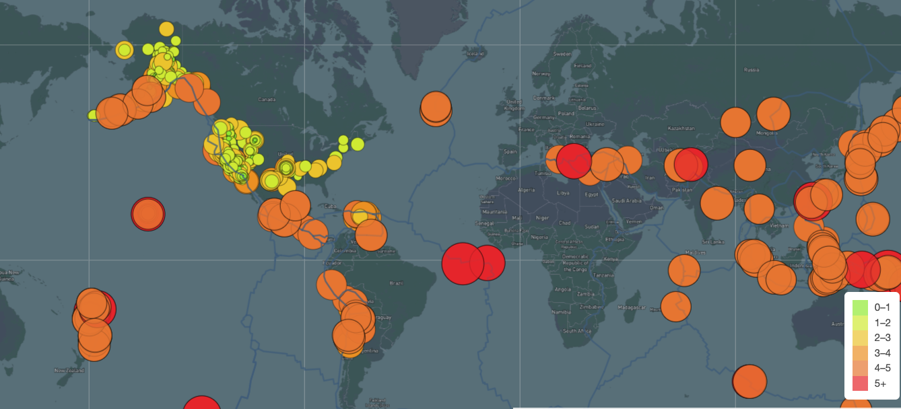
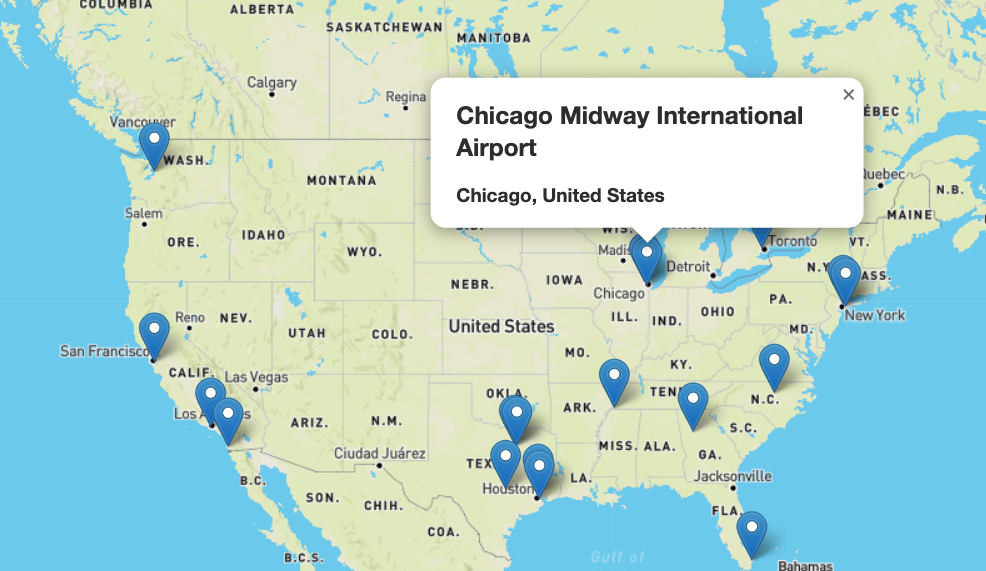
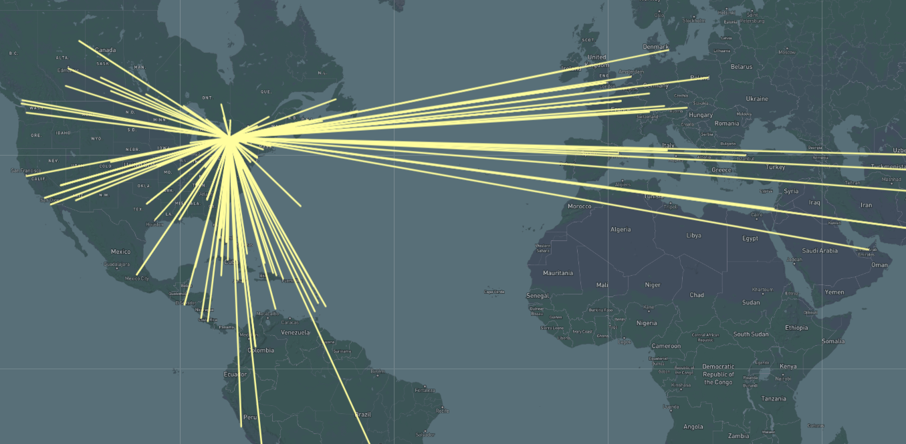
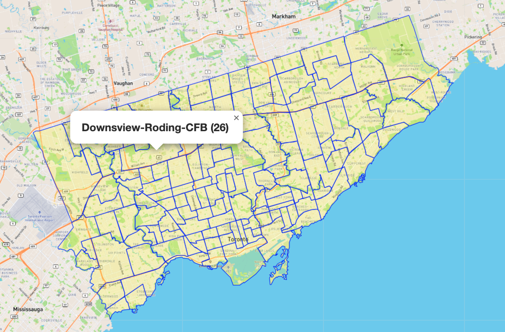
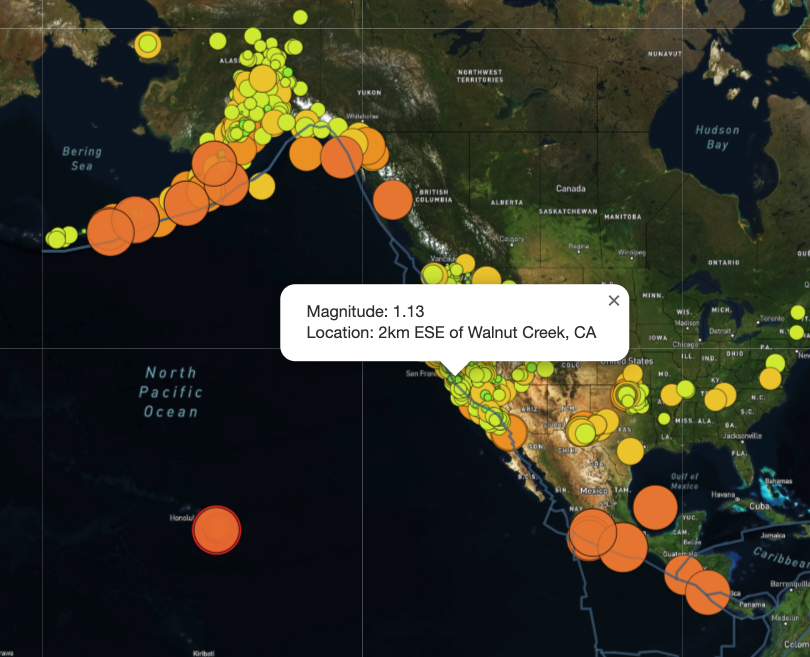
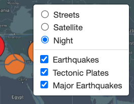
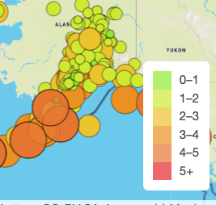

# Mapping Earthquakes:

# Overview 

This project entailed creating maps from several data sources to visualize Geo JSON data on maps using Leafly and Application Programming Interface (API) calls to Mapbox.  The Earthquake Challenge project uses several overlays, including data showing tectonic fault lines, earthquakes reported by the USGS over the past seven days, as well highlighting the major earthquakes from the past week.

## **See the page in action [here](https://halesoysters.github.io/halesoysters.2.github.io/)**

## Results 
The first map I created was a return to populating pins on a map with data using JavaScript and D3 to parse information about major airports from a JSON file and plot them over a map layer provided by Mapbox.   

The next example is plotting GeoJSON Linestrings of flight paths out of a popular airport and customizing the map layer and line visualization.  

The next example takes neighborhood data from Toronto, Canada to fill in GeoJSON Polygons, including interactive data of each neighborhood.  You’ll notice the area is filled in with different color lines.  

## **See the interactive map of Toronto [here]( https://halesoysters.github.io/halesoysters.3.github.io-/)**

The final project shows several earthquake data overlays including interactive information about the size and location.  

Last, an interactive layer is added to toggle between maps and data points presented, as well as a legend to understand the data.

  
